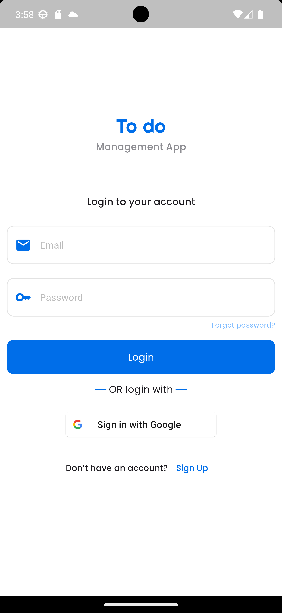
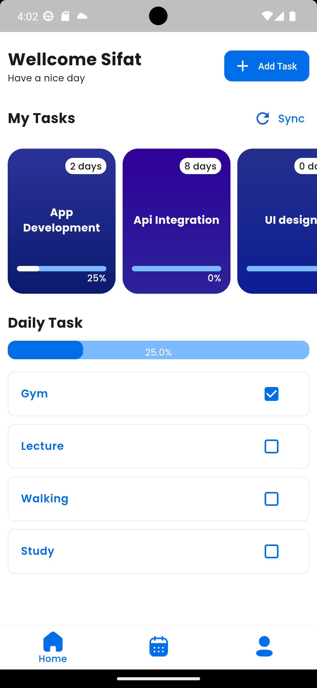
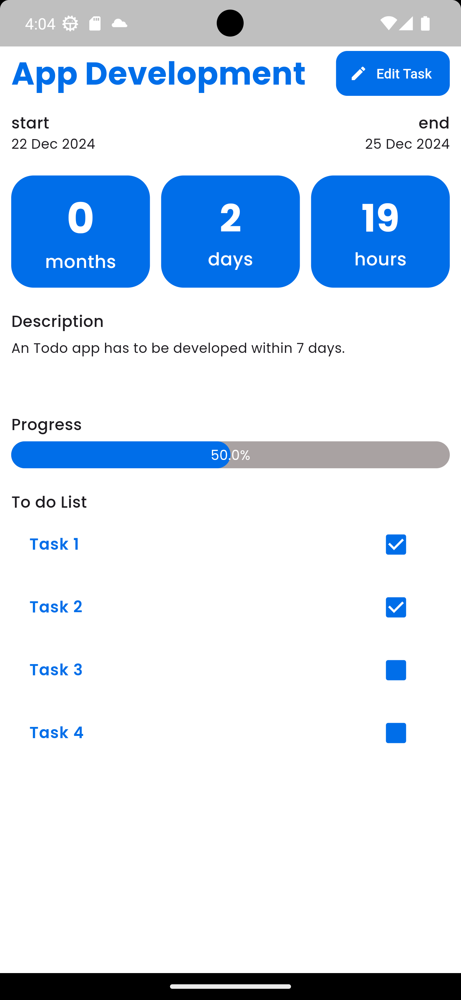
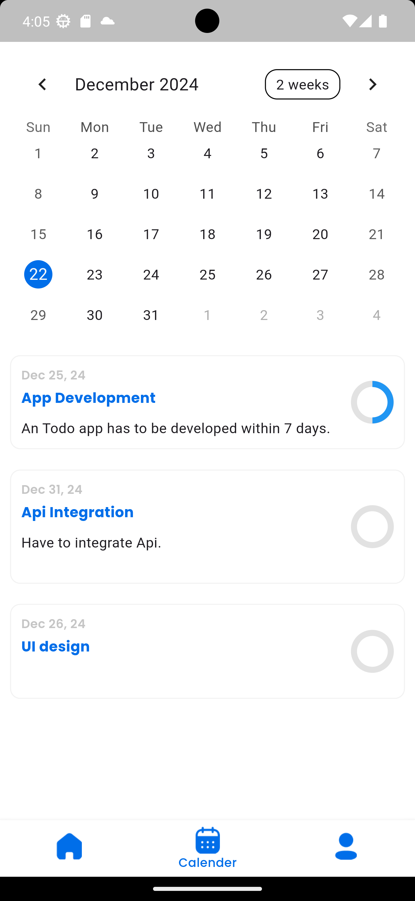
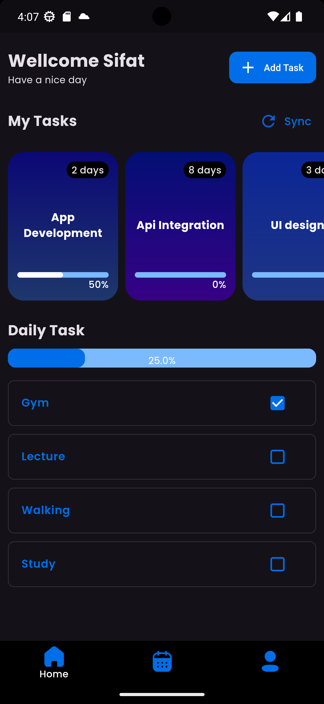
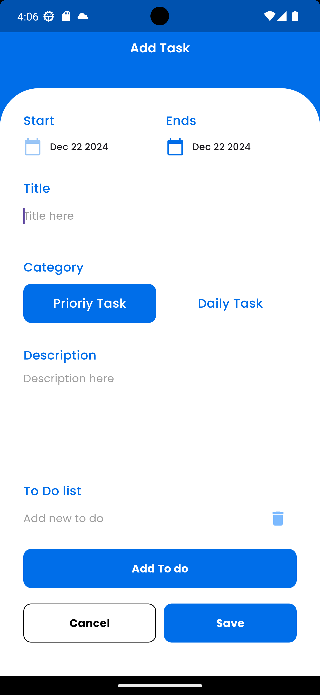
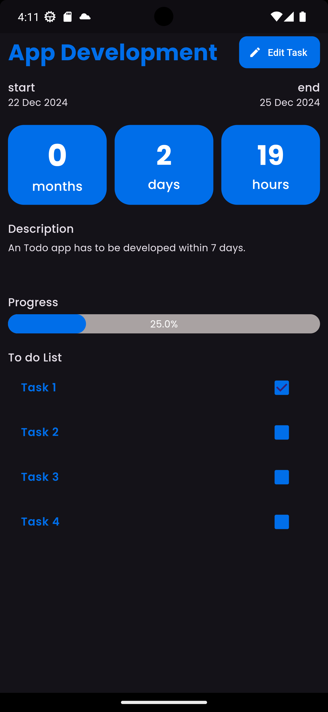

# Flutter Todo App

A comprehensive task management application built with Flutter and Firebase, featuring daily task tracking, dark mode support, and calendar integration.

## 🌟 Features

### Task Management
- ✏️ Create, edit, and delete tasks
- ✅ Mark tasks as complete/incomplete
- 📅 Set due dates and track progress
- 🔄 Real-time synchronization

### Daily Tasks
- 📋 Dedicated daily task tracking
- 📊 Progress monitoring
- 🎯 Task completion statistics
- 🔔 Task reminders

### User Experience
- 🌓 Dark/Light mode toggle
- 📱 Responsive design
- 🗓️ Calendar view
- 🔐 Secure authentication

## 🛠 Screenshots

<div style="display: flex; flex-wrap: wrap; gap: 10px;">






</div>

### Dark Mode
<div style="display: flex; gap: 10px;">


</div>

### Light Mode
<div style="display: flex; gap: 10px;">


</div>

## 🛠️ Tech Stack

- **Frontend**: Flutter
- **State Management**: GetX
- **Backend**: Firebase
- **Local Storage**: Shared Preferences
- **Authentication**: Firebase Auth

## 📦 Project Structure

```
lib/
├── app/
│   ├── controllers/
│   │   ├── daily_task_controller.dart
│   │   ├── task_controller.dart
│   │   └── darkmode_controller.dart
│   ├── models/
│   │   └── userdata.dart
│   ├── screens/
│   │   ├── home_page.dart
│   │   ├── login_page.dart
│   │   ├── task_details.dart
│   │   └── CalenderScreen.dart
│   ├── services/
│   │   └── authservice.dart
│   └── ui_helper/
│       ├── colors.dart
│       └── widgets.dart
└── main.dart
```

## 🚀 Getting Started

### Prerequisites

- Flutter (Latest Version)
- Firebase Account
- Android Studio/VS Code
- Git

### Installation

1. Clone the repository
```bash
git clone https://github.com/zsifat/Todo_App.git
```

2. Install dependencies
```bash
cd Todo_App
flutter pub get
```

3. Firebase Setup
   - Create a new Firebase project
   - Enable Authentication
   - Configure Cloud Firestore
   - Add Firebase configuration files:
     - Add `google-services.json` to `android/app/`
     - Add `GoogleService-Info.plist` to `ios/Runner/`

4. Run the application
```bash
flutter run
```

## 📱 Dependencies

```yaml
dependencies:
  flutter:
    sdk: flutter
  firebase_core: ^2.24.2
  firebase_auth: ^4.15.3
  cloud_firestore: ^4.13.6
  get: ^4.6.6
  shared_preferences: ^2.2.2
```

## 🤝 Contributing

1. Fork the Project
2. Create your Feature Branch (`git checkout -b feature/AmazingFeature`)
3. Commit your Changes (`git commit -m 'Add some AmazingFeature'`)
4. Push to the Branch (`git push origin feature/AmazingFeature`)
5. Open a Pull Request

## 📄 License

This project is licensed under the MIT License - see the [LICENSE](LICENSE) file for details.

## 👤 Author

**Zsifat**

## 🙏 Acknowledgments

- Flutter Development Team
- Firebase
- GetX Team
- All contributors and supporters

## 🔗 Links

- Project Repository: [https://github.com/zsifat/Todo_App](https://github.com/zsifat/Todo_App)
```

This README includes:
1. A clear project overview
2. Detailed feature list
3. Complete setup instructions
4. Accurate project structure
5. Proper dependency information
6. Contributing guidelines
